<!-- README.md is generated from README.Rmd. Please edit that file -->

# lofifonts

<!-- badges: start -->


[](https://github.com/coolbutuseless/lofifonts/actions/workflows/R-CMD-check.yaml)
[](https://CRAN.R-project.org/package=lofifonts)
<!-- badges: end -->

`lofifonts` provides access to raw data for the included bitmap and
vector fonts.

Bitmap and vector fonts allow for bespoke rendering of pixels and
strokes in situations where fine control over rendering is required. For
example, individual pixels and strokes could be animated to create novel
effects like exploding or coalescing text. With access to coordinates,
variations in 3D also become possible.

This package will render text with a specified bitmap or vector font to:

- a data.frame of coordinates (for bitmap fonts)
- a data.frame of character strokes (for vector coordinates)
- a binary matrix indicating the rendered text
- a raster image of the rendered text

### What’s in the box

- Bitmap font functions
  - `bitmap_text_coords()` create a data.frame of pixel locations
  - `bitmap_text_matrix()` create a binary matrix with pixel locations
    set to 1
  - `bitmap_text_raster()` create a raster image of the text
- Vector font functions
  - `vector_text_coords()` create a data.frame of strokes
  - `vector_text_matrix()` create a binary matrix with pixel locations
    set to 1
  - `vector_text_raster()` create a raster image of the text

### Fonts

| Type | Name | Sizes | Unicode? | \# glyphs |
|----|----|----|----|----|
| Bitmap | Spleen | 5x8, 6x12, 8x16, 12x24, 16x32 | Some | 450-1000 |
| Bitmap | Tamzen | 5x9, 6x12, 7x13, 8x15, 8x16, 10x20 bold/regular | Some | 180 |
| Bitmap | Unifont | 16x16 | Yes. Plane 0, 1 | 113446 |
| Bitmap | Unscii | 8x8, 8x16 | Some | 3240 |
| Vector | gridfont |  | Lower case ASCII only | 68 |
| Vector | gridfont_smooth |  | Lower case ASCII only | 68 |
| Vector | arcade |  | Upper case ASCII only | 66 |

Bitmap fonts:

- [Spleen v2.1.0](https://github.com/fcambus/spleen) License: BSD
  2-clause. See `LICENSE-spleen.txt`
- [Tamzen v1.11.6](https://github.com/sunaku/tamzen-font) Free to
  distribute
- [Unifont v16.0.0.1](https://unifoundry.com/unifont/) License: SIL Open
  Font License (OFL) version 1.1. See `LICENSE-unifont.txt`
- [Unscii v2.0](https://github.com/viznut/unscii) Font is in the public
  domain.

Vector fonts

- [gridfont](https://github.com/inconvergent/gridfont) License: MIT. See
  `LICENSE-gridfont.txt`
- `arcade` is a vector font I created. License: SIL Open Font License
  (OFL) version 1.1. See `LICENSE-arcade.txt`

## Installation

You can install from
[GitHub](https://github.com/coolbutuseless/lofifonts) with:

``` r
# install.package('remotes')
remotes::install_github('coolbutuseless/lofifonts')
```

## Included fonts

``` r
get_lofi_names('bitmap')
```

    #>  [1] "spleen-12x24"  "spleen-16x32"  "spleen-32x64"  "spleen-5x8"   
    #>  [5] "spleen-6x12"   "spleen-8x16"   "tamzen10x20b"  "tamzen10x20r" 
    #>  [9] "tamzen5x9b"    "tamzen5x9r"    "tamzen6x12b"   "tamzen6x12r"  
    #> [13] "tamzen7x13b"   "tamzen7x13r"   "tamzen7x14b"   "tamzen7x14r"  
    #> [17] "tamzen8x15b"   "tamzen8x15r"   "tamzen8x16b"   "tamzen8x16r"  
    #> [21] "unifont"       "unscii-8"      "unscii-8-thin"

``` r
get_lofi_names('vector')
```

    #> [1] "arcade"          "gridfont"        "gridfont_smooth"

## Bitmap font: Rendering text

Text may be rendered with a bitmap font to

1.  A data.frame of pixel locations
2.  A binary matrix of pixel locations
3.  A simple `raster` object

``` r
library(lofifonts)
bitmap_text_coords("Hello", font = 'unifont') |>
  head()
```

    #>      char_idx codepoint x  y line x0 y0
    #> 2524        1        72 7 12    0  7 12
    #> 2525        1        72 2 12    0  2 12
    #> 2526        1        72 7 11    0  7 11
    #> 2527        1        72 2 11    0  2 11
    #> 2528        1        72 7 10    0  7 10
    #> 2529        1        72 2 10    0  2 10

``` r
bitmap_text_matrix("Hello", "unifont") 
```

    #>       [,1] [,2] [,3] [,4] [,5] [,6] [,7] [,8] [,9] [,10] [,11] [,12] [,13]
    #>  [1,]    0    0    0    0    0    0    0    0    0     0     0     0     0
    #>  [2,]    0    1    0    0    0    0    1    0    0     0     0     0     0
    #>  [3,]    0    1    0    0    0    0    1    0    0     0     0     0     0
    #>  [4,]    0    1    0    0    0    0    1    0    0     0     1     1     1
    #>  [5,]    0    1    0    0    0    0    1    0    0     1     0     0     0
    #>  [6,]    0    1    1    1    1    1    1    0    0     1     0     0     0
    #>  [7,]    0    1    0    0    0    0    1    0    0     1     1     1     1
    #>  [8,]    0    1    0    0    0    0    1    0    0     1     0     0     0
    #>  [9,]    0    1    0    0    0    0    1    0    0     1     0     0     0
    #> [10,]    0    1    0    0    0    0    1    0    0     1     0     0     0
    #> [11,]    0    1    0    0    0    0    1    0    0     0     1     1     1
    #> [12,]    0    0    0    0    0    0    0    0    0     0     0     0     0
    #> [13,]    0    0    0    0    0    0    0    0    0     0     0     0     0
    #>       [,14] [,15] [,16] [,17] [,18] [,19] [,20] [,21] [,22] [,23] [,24] [,25]
    #>  [1,]     0     0     0     0     0     0     1     1     0     0     0     0
    #>  [2,]     0     0     0     0     0     0     0     1     0     0     0     0
    #>  [3,]     0     0     0     0     0     0     0     1     0     0     0     0
    #>  [4,]     1     0     0     0     0     0     0     1     0     0     0     0
    #>  [5,]     0     1     0     0     0     0     0     1     0     0     0     0
    #>  [6,]     0     1     0     0     0     0     0     1     0     0     0     0
    #>  [7,]     1     1     0     0     0     0     0     1     0     0     0     0
    #>  [8,]     0     0     0     0     0     0     0     1     0     0     0     0
    #>  [9,]     0     0     0     0     0     0     0     1     0     0     0     0
    #> [10,]     0     1     0     0     0     0     0     1     0     0     0     0
    #> [11,]     1     0     0     0     0     1     1     1     1     1     0     0
    #> [12,]     0     0     0     0     0     0     0     0     0     0     0     0
    #> [13,]     0     0     0     0     0     0     0     0     0     0     0     0
    #>       [,26] [,27] [,28] [,29] [,30] [,31] [,32] [,33] [,34] [,35] [,36] [,37]
    #>  [1,]     0     0     1     1     0     0     0     0     0     0     0     0
    #>  [2,]     0     0     0     1     0     0     0     0     0     0     0     0
    #>  [3,]     0     0     0     1     0     0     0     0     0     0     0     0
    #>  [4,]     0     0     0     1     0     0     0     0     0     1     1     1
    #>  [5,]     0     0     0     1     0     0     0     0     1     0     0     0
    #>  [6,]     0     0     0     1     0     0     0     0     1     0     0     0
    #>  [7,]     0     0     0     1     0     0     0     0     1     0     0     0
    #>  [8,]     0     0     0     1     0     0     0     0     1     0     0     0
    #>  [9,]     0     0     0     1     0     0     0     0     1     0     0     0
    #> [10,]     0     0     0     1     0     0     0     0     1     0     0     0
    #> [11,]     0     1     1     1     1     1     0     0     0     1     1     1
    #> [12,]     0     0     0     0     0     0     0     0     0     0     0     0
    #> [13,]     0     0     0     0     0     0     0     0     0     0     0     0
    #>       [,38] [,39]
    #>  [1,]     0     0
    #>  [2,]     0     0
    #>  [3,]     0     0
    #>  [4,]     1     0
    #>  [5,]     0     1
    #>  [6,]     0     1
    #>  [7,]     0     1
    #>  [8,]     0     1
    #>  [9,]     0     1
    #> [10,]     0     1
    #> [11,]     1     0
    #> [12,]     0     0
    #> [13,]     0     0

``` r
bitmap_text_raster("Hello", "unifont") |>
  plot(interpolate = FALSE)
```


``` r
# Render codepoints directly
bitmap_text_raster(intToUtf8(c(0x1f44d, 0x1f44e)), "unifont") |>
  plot(interpolate = FALSE)
```


## Bitmap font: Bespoke pixel rendering

This is an example of bespoke rendering of the pixel data for an example
string.

Each pixel in the `coords` data.frame has an `x` and `y` coordinates,
and to render this font, a small square will be drawn for each pixel.

A gap will be left between the rectangels to highlight the pixelated
origin of the text.

``` r
library(grid)
coords <- bitmap_text_coords("Hello\n#RStats", "spleen-6x12")
head(coords)
```

    #>     char_idx codepoint x  y line x0 y0
    #> 516        1        72 5 23    0  5 11
    #> 517        1        72 1 23    0  1 11
    #> 518        1        72 5 22    0  5 10
    #> 519        1        72 1 22    0  1 10
    #> 520        1        72 5 21    0  5  9
    #> 521        1        72 1 21    0  1  9

``` r
grid.newpage()
grid.rect(
  x = coords$x * 4, 
  y = coords$y * 4, 
  width  = 3, 
  height = 3, 
  default.units = 'mm',
  gp = gpar(fill = rainbow(nrow(coords)), col = NA)
)
```


## Vector font: Rendering text

Text may be rendered with a vector font to

1.  A data.frame of stroke endpoints
2.  A binary matrix of pixel locations
3.  A simple `raster` object

``` r
library(lofifonts)
vector_text_coords("Hello") |> 
  head()
```

    #>     char_idx codepoint stroke_idx         x        y line        x0       y0
    #> 494        1       104          1 0.0000000 9.000000    0 0.0000000 9.000000
    #> 495        1       104          1 0.0000000 3.000000    0 0.0000000 3.000000
    #> 496        1       104          2 0.0000000 5.666667    0 0.0000000 5.666667
    #> 497        1       104          2 0.1666667 6.333333    0 0.1666667 6.333333
    #> 498        1       104          2 0.6666667 6.833333    0 0.6666667 6.833333
    #> 499        1       104          2 1.1666667 7.000000    0 1.1666667 7.000000

``` r
vector_text_matrix("Hello", scale = 1) 
```

    #>       [,1] [,2] [,3] [,4] [,5] [,6] [,7] [,8] [,9] [,10] [,11] [,12] [,13]
    #>  [1,]    1    0    0    0    0    0    0    0    0     0     1     0     1
    #>  [2,]    1    0    0    0    0    0    0    0    0     0     1     0     1
    #>  [3,]    1    1    1    0    0    0    1    1    0     0     1     0     1
    #>  [4,]    1    0    0    1    0    1    0    0    1     0     1     0     1
    #>  [5,]    1    0    0    1    0    1    1    1    1     0     1     0     1
    #>  [6,]    1    0    0    1    0    1    0    0    1     0     1     0     1
    #>  [7,]    1    0    0    0    0    0    1    1    0     0     1     0     1
    #>  [8,]    0    0    0    0    0    0    0    0    0     0     0     0     0
    #>  [9,]    0    0    0    0    0    0    0    0    0     0     0     0     0
    #> [10,]    0    0    0    0    0    0    0    0    0     0     0     0     0
    #>       [,14] [,15] [,16] [,17] [,18]
    #>  [1,]     0     0     0     0     0
    #>  [2,]     0     0     0     0     0
    #>  [3,]     0     0     1     1     0
    #>  [4,]     0     1     0     0     1
    #>  [5,]     0     1     0     0     1
    #>  [6,]     0     1     0     0     1
    #>  [7,]     0     0     1     1     0
    #>  [8,]     0     0     0     0     0
    #>  [9,]     0     0     0     0     0
    #> [10,]     0     0     0     0     0

``` r
vector_text_raster("Hello\n#RStats!", scale = 5) |>
  plot(interpolate = FALSE)
```


## Vector font: Bespoke pixel rendering

This is an example of bespoke rendering of the strokes for an example
string.

For each character (`char_idx`) there are 1-or-more strokes (`stroke`).
Each stroke has has 2 or more rows giving the path for this particular
stroke.

When plotting with ggplot, draw path for the
points-within-strokes-within-characters.

``` r
library(ggplot2)

coords <- vector_text_coords("Hello")
head(coords)
```

    #> # A tibble: 6 × 8
    #>   char_idx codepoint stroke_idx     x     y  line    x0    y0
    #>      <int>     <int>      <int> <dbl> <dbl> <int> <dbl> <dbl>
    #> 1        1       104          1 0      9        0 0      9   
    #> 2        1       104          1 0      3        0 0      3   
    #> 3        1       104          2 0      5.67     0 0      5.67
    #> 4        1       104          2 0.167  6.33     0 0.167  6.33
    #> 5        1       104          2 0.667  6.83     0 0.667  6.83
    #> 6        1       104          2 1.17   7        0 1.17   7

``` r
ggplot(coords) +
  geom_path(aes(x, y, 
                group = interaction(char_idx, stroke_idx), 
                colour = as.factor(char_idx)), 
            linewidth = 4) +
  geom_point(aes(x, y), color = 'yellow') + 
  theme_bw() +
  theme(legend.position = 'bottom') + 
  coord_equal()
```


## Unicode support

The font with the best unicode coverage is the bitmap font `unifont`

``` r
library(lofifonts)

txt <- "二項分布\xF0\x9F\x8E\xB2の英語表記は\n「Binomial distribution」である。"

#~~~~~~~~~~~~~~~~~~~~~~~~~~~~~~~~~~~~~~~~~~~~~~~~~~~~~~~~~~~~~~~~~~~~~~~~~~~~
# Render quickly with built-in conversion
#~~~~~~~~~~~~~~~~~~~~~~~~~~~~~~~~~~~~~~~~~~~~~~~~~~~~~~~~~~~~~~~~~~~~~~~~~~~~
bitmap_text_raster(txt, "unifont") |>
  plot(interpolate = FALSE)
```

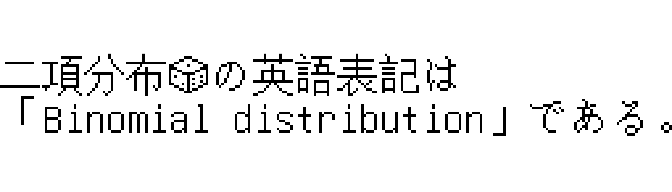

``` r
#~~~~~~~~~~~~~~~~~~~~~~~~~~~~~~~~~~~~~~~~~~~~~~~~~~~~~~~~~~~~~~~~~~~~~~~~~~~~
# Bespoke plotting of the pixel locations
#~~~~~~~~~~~~~~~~~~~~~~~~~~~~~~~~~~~~~~~~~~~~~~~~~~~~~~~~~~~~~~~~~~~~~~~~~~~~
coords <- bitmap_text_coords(txt, "unifont")

ggplot(coords) +
  geom_tile(aes(x, y, fill = as.factor(char_idx)), na.rm = TRUE) +
  theme_void(10) +
  coord_equal() + 
  theme(legend.position = 'none')
```


## Rendering with `{bittermelon}` fonts

[`bittermelon`](https://cran.r-project.org/package=bittermelon) is a
package which supports reading and manipulating many different types of
bitmap font.

To use a font loaded with `bittermelon` is must first be convert to the
`lofi` format which this package understands.

``` r
# Load font using "bittermelon"
filename <- system.file("fonts/fixed/4x6.yaff.gz", package = "bittermelon", mustWork = TRUE)
bmfont <- bittermelon::read_yaff(filename)

# Convert to lofi format
lofi <- convert_bm_font_to_lofi(bmfont)
lofi
```

    #> [lofi font] 4 x 6. 919 codepoints.

``` r
# Layout the text and render to a raster
bitmap_text_raster('hello', font = lofi) |>
  plot(interpolate = FALSE)
```


## Large block of text in bitmap font

``` r
library(lorem)
set.seed(1)
oldpar <- par(mai = c(0, 0, 0, 0))

lorem::ipsum(2) |>
  strwrap(40) |>
  paste(collapse = "\n") |>
  bitmap_text_raster() |>
  plot()
```

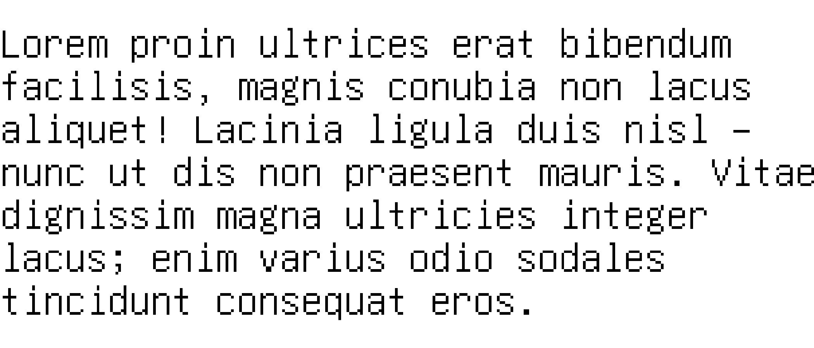

``` r
par(oldpar)
```

## Large block of text in vector font

``` r
library(lorem)
set.seed(1)
oldpar <- par(mai = c(0, 0, 0, 0))

lorem::ipsum(1) |>
  strwrap(60) |>
  paste(collapse = "\n") |>
  vector_text_raster() |>
  plot(interpolate = FALSE)
```


``` r
par(oldpar)
```

## Bitmap Fonts: Font Sheets

A selection of the glyphs from each of the bitmap fonts

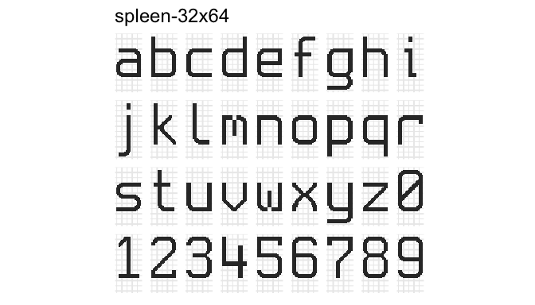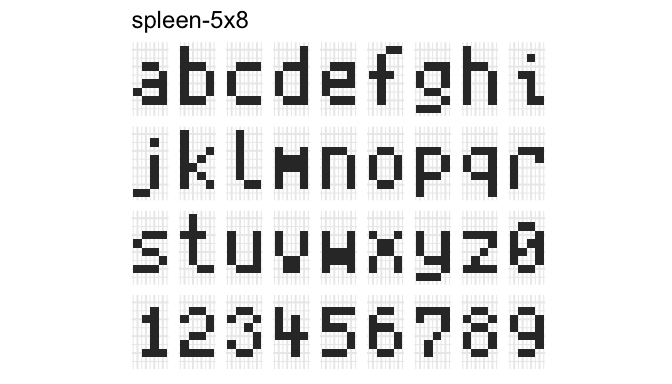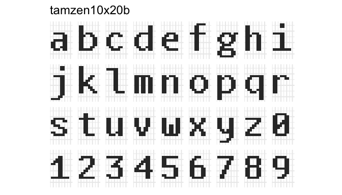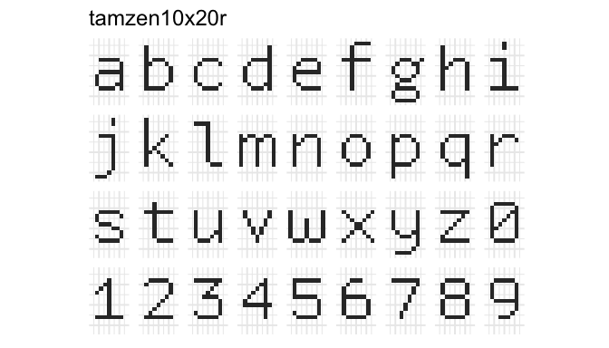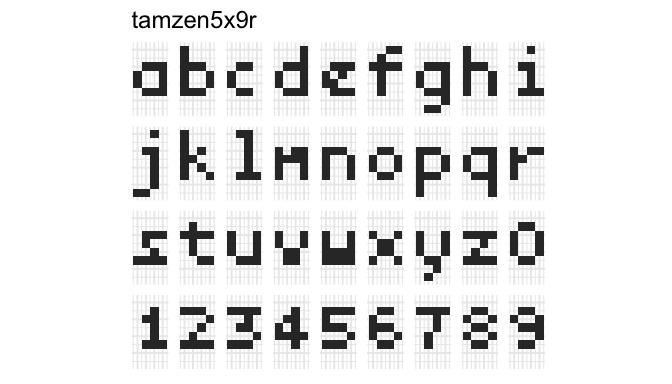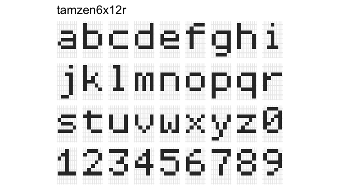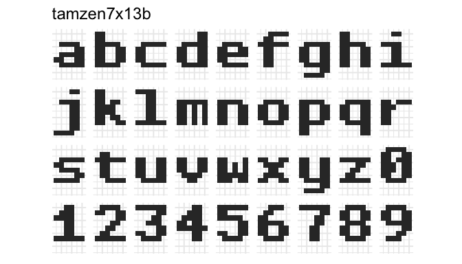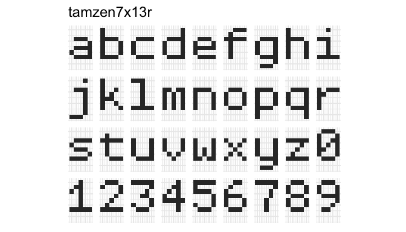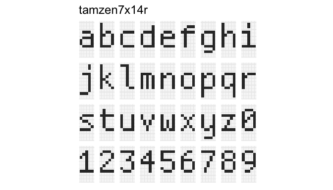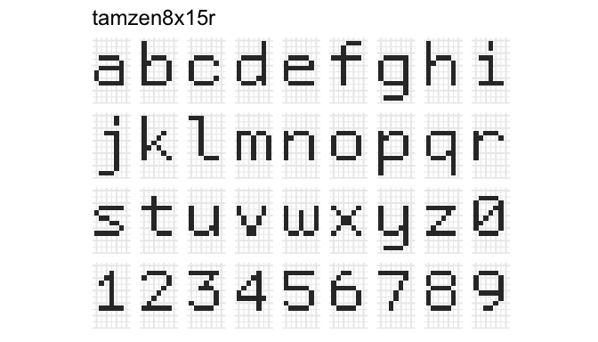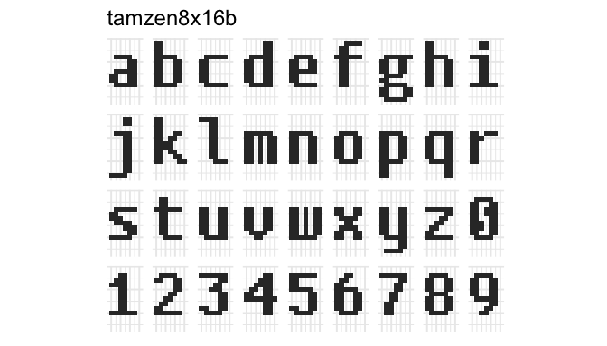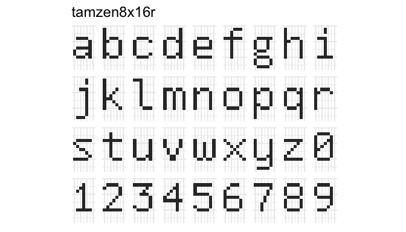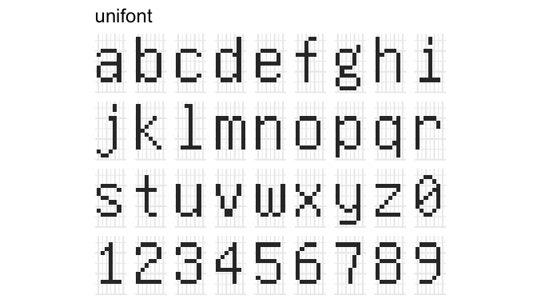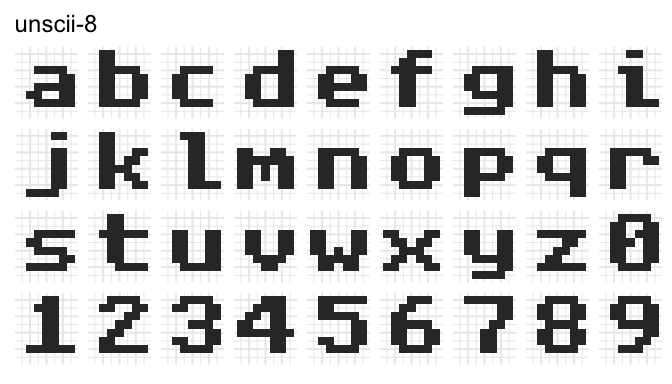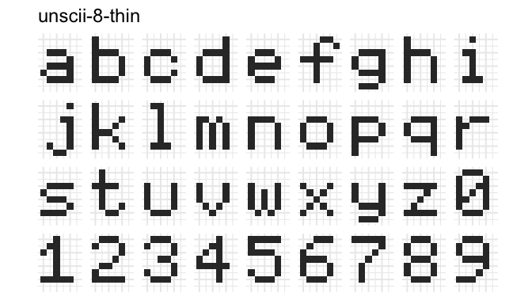

## Vector fonts: Font Sheets

A selection of the glyphs from each of the vector fonts


